# Chapitre : Développement de l'Application Mobile RescueWave

---

## 1. Introduction

Dans le cadre de notre projet de fin d'études, nous avons conçu et développé une application mobile baptisée **RescueWave**, réalisée avec le framework Flutter. Cette application constitue le volet numérique d'un système de surveillance aquatique intelligente dont l'objectif principal est d'assurer la détection rapide des noyades et de coordonner les interventions de sauvetage en mer ou en piscine. Elle s'appuie sur un bateau autonome équipé d'une caméra à intelligence artificielle connectée à un Raspberry Pi, capable d'identifier en temps réel toute situation de danger aquatique. Les alertes générées sont transmises instantanément au personnel de surveillance via l'application mobile, qui centralise toutes les informations nécessaires à une intervention efficace.

L'application, bien qu'encore en phase de développement, couvre d'ores et déjà les fonctionnalités essentielles : l'authentification des utilisateurs selon leur rôle, la réception et la gestion des alertes de noyade, la consultation de l'historique des interventions, ainsi que l'administration des membres de l'équipe. Ce chapitre présente la modélisation, les choix techniques et un aperçu visuel de cette application.

---

## 2. Modélisation de la solution

### 2.1 Diagramme de cas d'utilisation

Le diagramme de cas d'utilisation constitue un outil de modélisation fondamental pour représenter les interactions entre les différents acteurs du système et les fonctionnalités qu'il met à leur disposition. Il permet de dégager une vision globale et compréhensible du comportement de l'application, indépendamment de son implémentation technique.

Dans le cadre de RescueWave, ce diagramme synthétise l'ensemble des actions réalisables selon chaque profil utilisateur, qu'il s'agisse de la gestion des alertes, de la supervision de l'équipe ou du suivi des interventions passées.

---

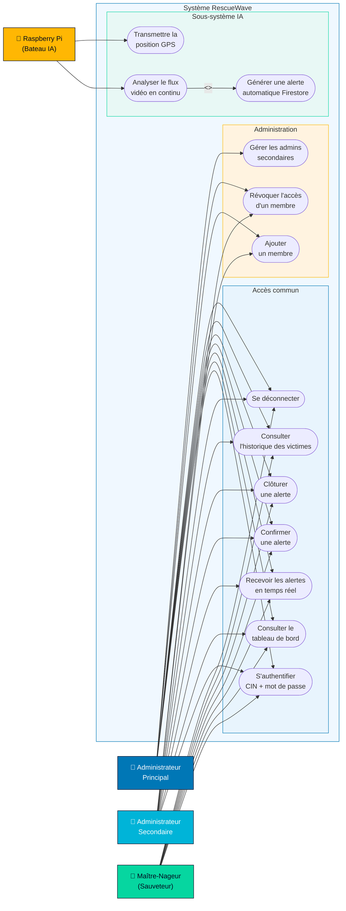
*Figure 1 — Diagramme de cas d'utilisation de l'application RescueWave*

---

### 2.2 Identification des acteurs

En modélisation UML, un acteur représente toute entité externe qui interagit avec le système. Il peut s'agir d'une personne physique ou d'un sous-système automatisé.

L'analyse fonctionnelle de notre projet a permis d'identifier les acteurs suivants :

- **L'Administrateur Principal :** Il dispose du niveau d'accès le plus élevé dans l'application. Il est responsable de la gestion complète de l'équipe : création et suppression des comptes de tous les utilisateurs, y compris les administrateurs secondaires. Il accède à l'ensemble des données du tableau de bord, des alertes et de l'historique des victimes.

- **L'Administrateur Secondaire :** Il gère un groupe de maîtres-nageurs qui lui sont assignés. Il peut créer et révoquer les comptes des membres placés sous sa responsabilité, suivre les alertes en cours et consulter l'historique des interventions.

- **Le Maître-Nageur (Sauveteur) :** Il représente le personnel opérationnel sur le terrain. Une fois connecté, il peut consulter les alertes actives, les confirmer lorsqu'il prend en charge une intervention, et les clôturer à la fin de la mission. Il n'a pas accès à la section d'administration.

- **Le Sous-système Raspberry Pi (Bateau autonome) :** Il ne s'agit pas d'un acteur humain mais d'un composant matériel automatisé. Le Raspberry Pi embarqué sur le bateau sauveteur analyse en continu le flux vidéo capturé par la caméra à l'aide d'un modèle d'intelligence artificielle. Lorsqu'une noyade est détectée, il génère automatiquement une alerte et la transmet à la base de données Firebase, déclenchant ainsi une notification en temps réel sur l'application mobile.

### 2.3 Description du diagramme de cas d'utilisation

L'application RescueWave organise ses fonctionnalités autour des rôles définis ci-dessus.

**Côté Administrateur Principal :**
- S'authentifier avec son numéro CIN et le mot de passe commun.
- Consulter le tableau de bord global (statistiques des alertes, interventions, taux de survie).
- Gérer l'ensemble des membres de l'équipe : créer un nouveau compte (maître-nageur ou administrateur secondaire) et révoquer l'accès d'un membre existant.
- Accéder à l'historique complet des victimes enregistrées par tous les sauveteurs.

**Côté Administrateur Secondaire :**
- S'authentifier et accéder à son espace personnel.
- Gérer les maîtres-nageurs qui lui sont rattachés.
- Suivre les alertes en cours et l'historique des interventions.

**Côté Maître-Nageur :**
- S'authentifier via son numéro CIN.
- Recevoir et consulter les alertes de noyade en temps réel.
- Confirmer une alerte lorsqu'il engage une opération de sauvetage.
- Clôturer une alerte une fois la mission terminée.
- Consulter l'historique des victimes prises en charge.

**Côté Sous-système Raspberry Pi :**
- Analyser en continu le flux vidéo de la caméra embarquée sur le bateau.
- Détecter automatiquement une situation de noyade grâce au modèle d'intelligence artificielle.
- Envoyer une alerte à la base de données Firebase avec les informations de localisation et l'heure de l'événement.
- Transmettre les coordonnées GPS du bateau en temps réel.

---

### 2.4 Diagrammes de séquence

Le diagramme de séquence est un outil de modélisation comportementale qui illustre l'ordre chronologique des échanges entre les acteurs et les composants du système pour un scénario précis. Plusieurs scénarios clés ont été modélisés pour décrire le fonctionnement de RescueWave.

#### 2.4.1 Diagramme de séquence « Authentification »

L'accès à l'application est conditionné par une étape d'authentification. L'utilisateur saisit son numéro CIN ainsi qu'un mot de passe commun à toute l'équipe. Le système vérifie l'existence du CIN dans la base de données Firestore et valide le mot de passe. En cas de succès, le rôle de l'utilisateur est identifié et l'interface correspondante s'affiche. En cas d'échec, un message d'erreur est retourné à l'utilisateur.

---

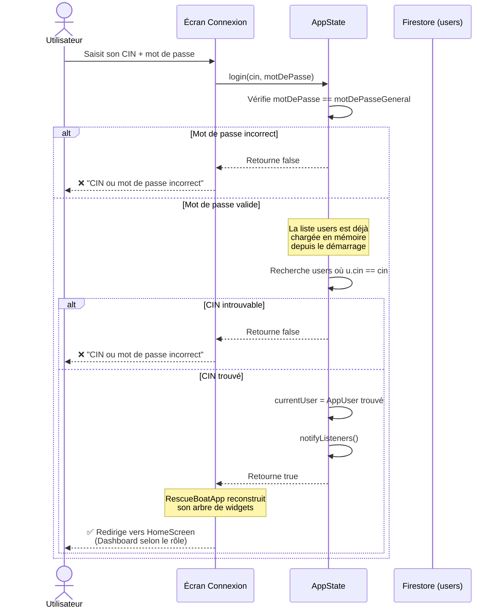
*Figure 2 — Diagramme de séquence — Authentification utilisateur*

---

#### 2.4.2 Diagramme de séquence « Réception d'une alerte de noyade »

Ce scénario décrit le flux déclenché lorsque le Raspberry Pi détecte une noyade. Le modèle d'intelligence artificielle identifie la situation de danger et envoie une nouvelle entrée dans la collection `alertes` de Firestore, avec les champs : heure, lieu et référence unique. L'application mobile, abonnée en temps réel à cette collection via un flux Firestore, reçoit instantanément la mise à jour. L'interface des alertes se rafraîchit automatiquement et affiche la nouvelle alerte à l'ensemble des utilisateurs connectés.

---

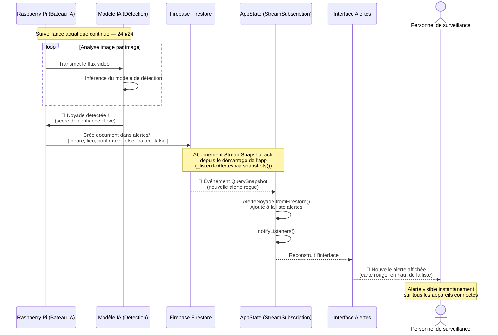
*Figure 3 — Diagramme de séquence — Réception d'une alerte de noyade*

---

#### 2.4.3 Diagramme de séquence « Confirmation et clôture d'une alerte »

Une fois une alerte reçue, le maître-nageur ou l'administrateur peut la prendre en charge. Il appuie sur le bouton « Confirmer », ce qui met à jour le champ `confirmee` à `true` dans Firestore. L'alerte passe alors au statut « Mission confirmée ». Lorsque l'opération de sauvetage est terminée, l'utilisateur appuie sur « Mission terminée », ce qui met à jour le champ `traitee` à `true`. L'alerte est ainsi clôturée et disparaît de la liste des alertes actives.

---

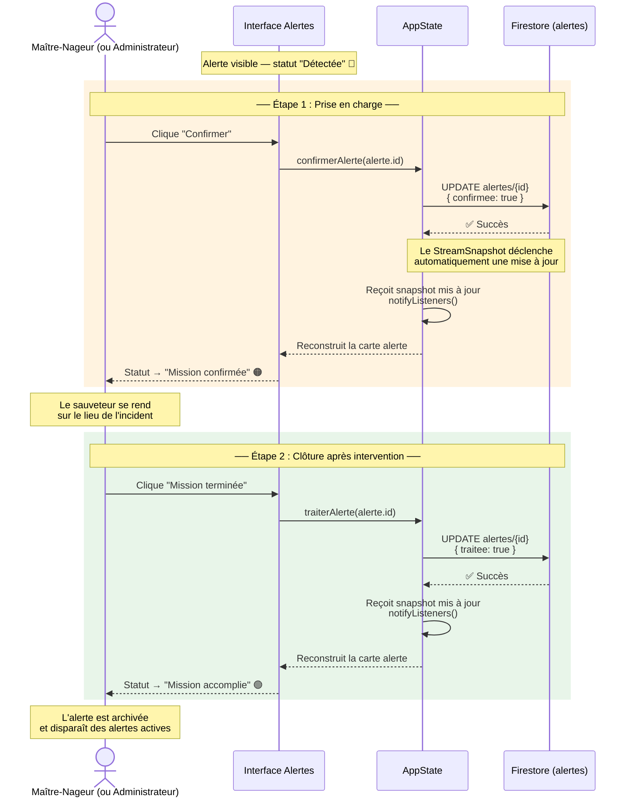
*Figure 4 — Diagramme de séquence — Confirmation et clôture d'une alerte*

---

#### 2.4.4 Diagramme de séquence « Création d'un compte membre »

L'administrateur accède au panneau d'administration et remplit un formulaire de création de compte comprenant : le numéro CIN, le nom, le prénom et le rôle du nouveau membre. L'application envoie ces informations à Firestore qui crée le document correspondant dans la collection `users`. Le nouveau membre peut dès lors se connecter à l'application avec son CIN.

---

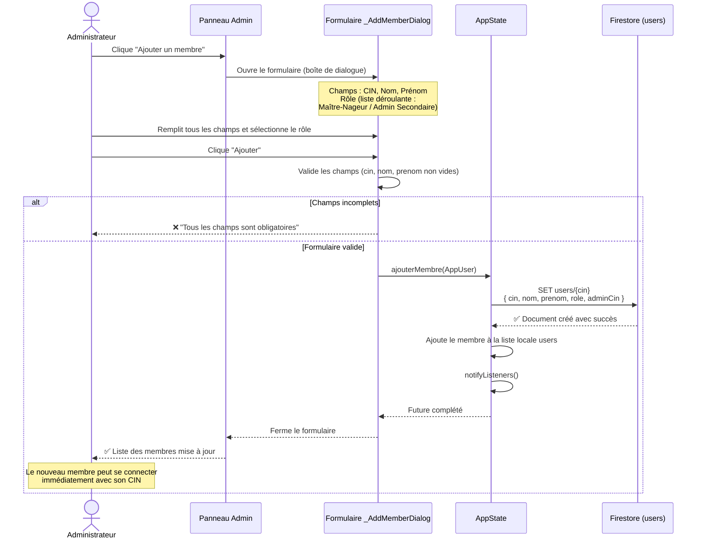
*Figure 5 — Diagramme de séquence — Création d'un compte membre*

---

#### 2.4.5 Diagramme de séquence « Consultation de l'historique »

L'utilisateur navigue vers l'onglet Historique. L'application, qui maintient un abonnement temps réel à la collection `historique` de Firestore, affiche automatiquement la liste des victimes enregistrées, triées par date décroissante. Chaque fiche contient : la date d'intervention, l'âge de la victime, le lieu, une description de l'incident et l'issue de l'intervention (survie ou décès).

---

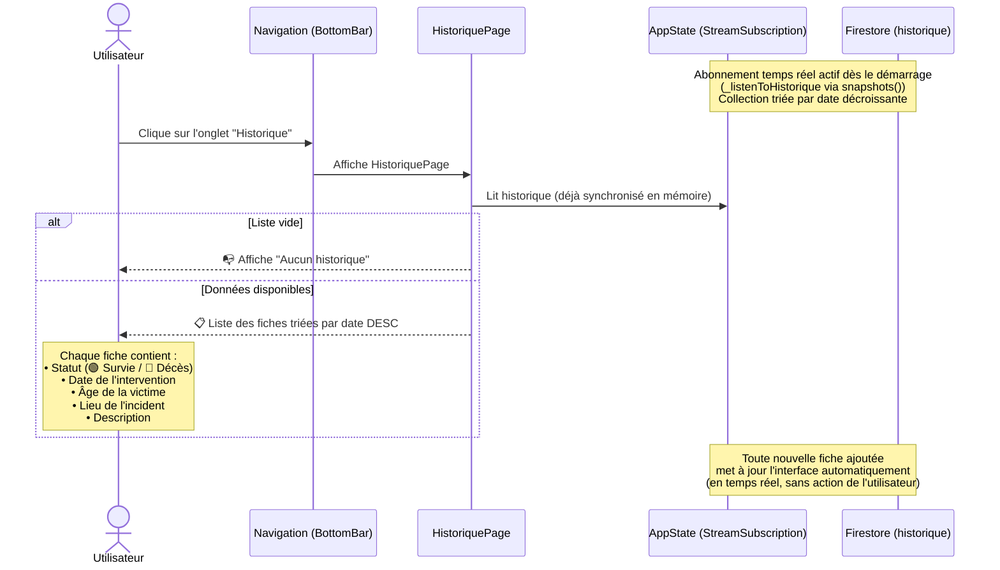
*Figure 6 — Diagramme de séquence — Consultation de l'historique*

---

### 2.5 Diagramme de classes

Le diagramme de classes offre une représentation statique de la structure interne de l'application. Il met en évidence les classes de données, leurs attributs, leurs méthodes et les relations qui les lient. Ce diagramme a guidé la conception des modèles Dart et la structure des collections Firestore.

---

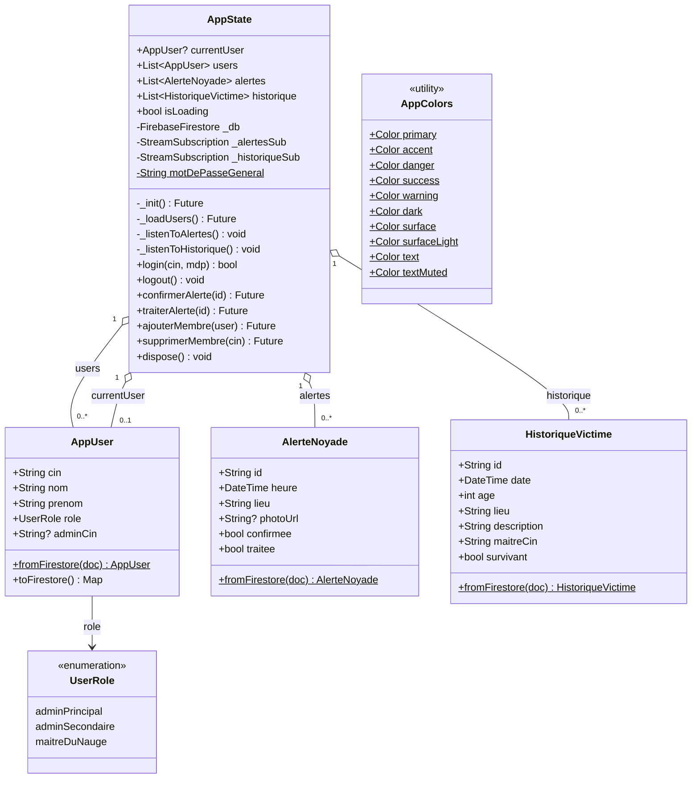
*Figure 7 — Diagramme de classes de l'application RescueWave*

---

**Description des classes :**

**La classe AppUser :** Elle représente tout membre du personnel autorisé à accéder à l'application. Elle contient les attributs suivants :
- `cin` : Numéro d'identité national, utilisé comme identifiant unique.
- `nom` : Nom de famille du membre.
- `prenom` : Prénom du membre.
- `role` : Rôle attribué au membre (adminPrincipal, adminSecondaire, maitreDuNauge).
- `adminCin` : Référence au CIN de l'administrateur responsable du membre.

Méthodes associées :
- `fromFirestore()` : Construit un objet AppUser à partir d'un document Firestore.
- `toFirestore()` : Convertit un objet AppUser en structure de données compatible avec Firestore.

**La classe AlerteNoyade :** Elle représente une alerte de noyade générée par le système de détection. Elle contient :
- `id` : Identifiant unique de l'alerte.
- `heure` : Horodatage de la détection.
- `lieu` : Description ou coordonnées du lieu de l'incident.
- `photoUrl` : Lien vers une éventuelle capture d'image de la caméra (optionnel).
- `confirmee` : Indicateur booléen signifiant qu'un sauveteur a pris en charge l'alerte.
- `traitee` : Indicateur booléen signifiant que l'intervention est terminée.

Méthodes associées :
- `fromFirestore()` : Construit un objet AlerteNoyade à partir d'un document Firestore.

**La classe HistoriqueVictime :** Elle conserve les données relatives à une victime prise en charge lors d'une intervention. Elle contient :
- `id` : Identifiant unique de la fiche.
- `date` : Date et heure de l'intervention.
- `age` : Âge estimé de la victime.
- `lieu` : Localisation de l'incident.
- `description` : Détails sur les circonstances de l'intervention.
- `maitreCin` : CIN du sauveteur ayant géré l'intervention.
- `survivant` : Booléen indiquant si la victime a survécu.

Méthodes associées :
- `fromFirestore()` : Construit un objet HistoriqueVictime à partir d'un document Firestore.

**La classe AppState :** Elle constitue le cœur de la gestion d'état de l'application. Elle centralise toutes les données de l'application et notifie l'interface de chaque modification. Elle contient :
- `currentUser` : L'utilisateur actuellement connecté.
- `users` : La liste de tous les membres de l'équipe.
- `alertes` : La liste des alertes en temps réel.
- `historique` : La liste des fiches victimes en temps réel.

Méthodes principales :
- `login()` : Vérifie les identifiants et connecte l'utilisateur.
- `logout()` : Déconnecte l'utilisateur courant.
- `confirmerAlerte()` : Met à jour le statut d'une alerte à « confirmée ».
- `traiterAlerte()` : Met à jour le statut d'une alerte à « traitée ».
- `ajouterMembre()` : Crée un nouveau compte utilisateur dans Firestore.
- `supprimerMembre()` : Supprime un compte utilisateur de Firestore.

---

## 3. Choix de la base de données

### 3.1 Le cloud comme socle technologique

Pour un système de surveillance dont la réactivité est une exigence critique, le recours à une infrastructure cloud s'impose naturellement. En effet, une alerte de noyade n'a de valeur que si elle parvient au sauveteur dans les secondes qui suivent sa détection. Le stockage local ne peut satisfaire cette contrainte, car les données doivent être accessibles simultanément par plusieurs appareils distribués géographiquement.

Le cloud permet à l'application de maintenir une synchronisation permanente entre le bateau équipé du Raspberry Pi, le serveur de données et les appareils mobiles du personnel de surveillance. C'est dans ce contexte que nous avons retenu Firebase, la plateforme cloud de Google, pour héberger et gérer l'ensemble des données de RescueWave.

### 3.2 Pourquoi Firebase ?

Firebase s'est imposé comme le choix le plus adapté à notre projet pour plusieurs raisons :

- **Synchronisation en temps réel :** Grâce aux flux Firestore (snapshots), toute nouvelle alerte générée par le Raspberry Pi est immédiatement répercutée sur les appareils des sauveteurs, sans qu'aucune action de leur part ne soit nécessaire.
- **Intégration native avec Flutter :** Les bibliothèques officielles Firebase pour Flutter (`firebase_core`, `cloud_firestore`, `firebase_messaging`) simplifient considérablement l'intégration et garantissent une compatibilité stable.
- **Stockage NoSQL flexible :** La structure documentaire de Firestore s'adapte facilement à l'évolution des modèles de données au fur et à mesure du développement de l'application.
- **Notifications push :** Firebase Cloud Messaging (FCM) permet d'envoyer des alertes directement aux appareils mobiles, même lorsque l'application est en arrière-plan.
- **Scalabilité :** Le service gère automatiquement la montée en charge sans nécessiter de configuration d'infrastructure supplémentaire.
- **Sécurité configurable :** Des règles d'accès personnalisées peuvent être définies pour restreindre la lecture et l'écriture selon les profils utilisateurs.

### 3.3 Technologies Firebase utilisées

#### 3.3.1 Cloud Firestore

Cloud Firestore est la base de données principale de RescueWave. Elle organise les données en collections de documents JSON. Trois collections structurent l'application :

- **`users`** : Contient un document par membre de l'équipe, identifié par son numéro CIN. Chaque document stocke le nom, le prénom, le rôle et la référence à l'administrateur responsable. Cette collection est chargée une seule fois au démarrage de l'application.

- **`alertes`** : Contient les alertes de noyade générées par le Raspberry Pi. Les documents sont ordonnés par horodatage décroissant. L'application maintient un abonnement en temps réel (`StreamSubscription`) à cette collection afin de recevoir chaque nouvelle alerte instantanément.

- **`historique`** : Regroupe les fiches de victimes enregistrées par les sauveteurs après chaque intervention. Elle est également souscrite en temps réel pour que le tableau de bord reflète toujours les données les plus récentes.

---

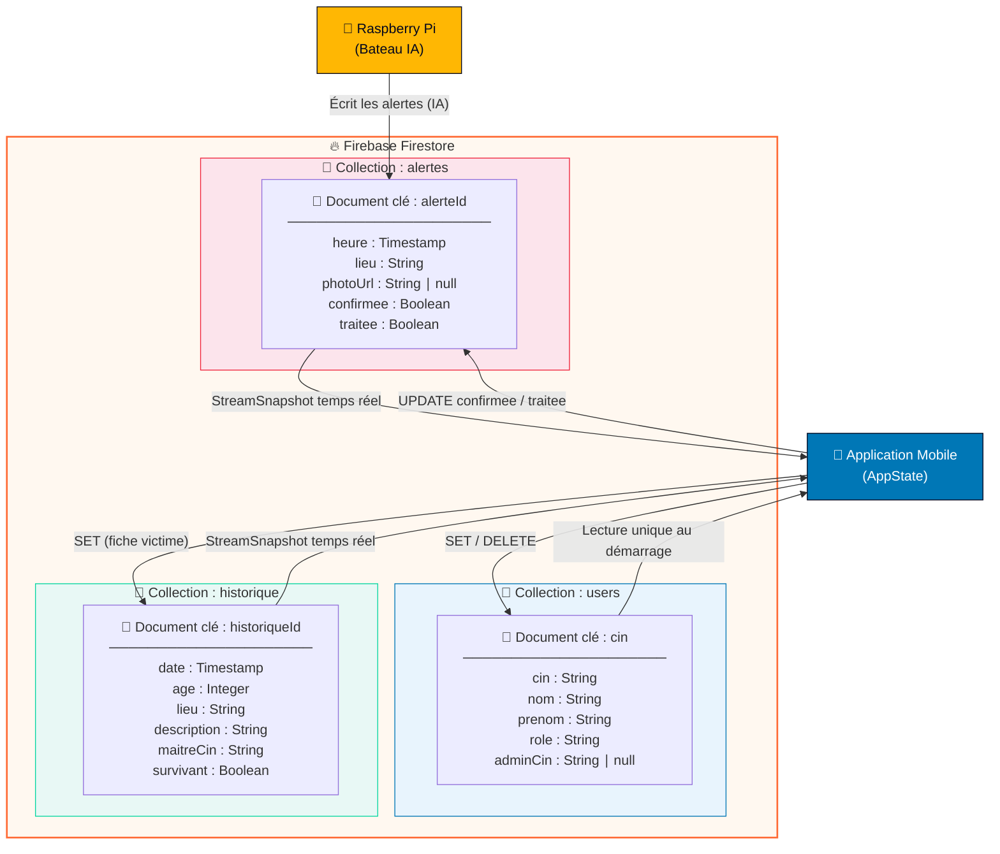
*Figure 8 — Structure des collections Firestore de RescueWave*

---

#### 3.3.2 Authentification et gestion des accès

L'authentification dans RescueWave repose sur un mécanisme interne fondé sur le numéro CIN de l'utilisateur et un mot de passe unique partagé par toute l'équipe. Lors de la connexion, l'application vérifie que le CIN saisi correspond à un document existant dans la collection `users`, puis valide le mot de passe saisi. Si les deux conditions sont réunies, le profil de l'utilisateur est chargé en mémoire et son rôle détermine les fonctionnalités auxquelles il a accès.

Ce mécanisme, bien que simplifié pour cette version de démonstration, pourra être renforcé dans une version ultérieure en intégrant Firebase Authentication pour une gestion plus sécurisée des sessions et des mots de passe individuels.

#### 3.3.3 Facteurs d'authentification

L'authentification mise en place dans la version actuelle de RescueWave repose sur un **facteur mémoriel**, c'est-à-dire une information que l'utilisateur connaît : son numéro CIN associé à un code d'accès commun. Ce facteur est le plus répandu dans les systèmes d'information et offre une prise en main simple pour le personnel de terrain.

Dans les évolutions futures du projet, d'autres facteurs pourront être envisagés pour renforcer la sécurité de l'accès, notamment :
- Un **facteur matériel** (carte d'accès ou appareil personnel enregistré),
- Un **facteur inhérent** (empreinte digitale ou reconnaissance faciale via le capteur biométrique du smartphone).

#### 3.3.4 Synchronisation et flux de données en temps réel

La synchronisation des données entre le Raspberry Pi et l'application mobile s'effectue entièrement via Firestore. Lorsqu'une alerte est détectée, le Raspberry Pi écrit un nouveau document dans la collection `alertes`. L'application, maintenant un abonnement actif à cette collection, reçoit automatiquement l'événement et met à jour l'interface sans que l'utilisateur n'ait à effectuer la moindre action.

Ce mécanisme de flux bidirectionnel garantit que toutes les mises à jour (confirmation, clôture d'une alerte, ajout d'un membre) sont répercutées en temps réel sur l'ensemble des appareils connectés.

#### 3.3.5 Sécurité et séparation des accès

Bien que l'application gère la séparation des rôles côté client (l'onglet Administration n'est accessible qu'aux administrateurs), des règles de sécurité Firestore peuvent être définies côté serveur pour garantir qu'aucun utilisateur non autorisé ne puisse accéder ou modifier des données qui ne le concernent pas, même en dehors de l'application.

#### 3.3.6 Stockage des données

L'ensemble des données de RescueWave est hébergé dans le cloud Firebase et non sur les appareils locaux. Cela présente plusieurs avantages : les données restent accessibles même en cas de changement d'appareil, les sauvegardes sont gérées automatiquement par la plateforme et la cohérence des données est garantie entre tous les utilisateurs simultanément connectés.

### 3.4 Conclusion sur le choix technique

Firebase répond pleinement aux exigences de RescueWave en matière de temps réel, de fiabilité et de simplicité d'intégration. La combinaison de Firestore pour le stockage et la synchronisation, et de Firebase Cloud Messaging pour les notifications, constitue un socle solide pour un système dont la rapidité de réaction peut avoir des conséquences directes sur la sécurité des personnes.

---

## 4. Aperçu visuel de l'application mobile

Après avoir présenté la modélisation et les choix techniques, nous exposons dans cette section les différentes interfaces de l'application RescueWave développée. Compte tenu du caractère évolutif du projet — l'application étant encore en phase de développement — les interfaces présentées ci-dessous correspondent à la version de démonstration fonctionnelle actuelle.

L'application est structurée autour de trois profils utilisateurs distincts dont les interfaces diffèrent selon le niveau d'accès :

- **Maître-Nageur (Sauveteur) :** accès aux alertes et à l'historique.
- **Administrateur Secondaire :** accès aux alertes, à l'historique et à la gestion de son équipe.
- **Administrateur Principal :** accès complet à toutes les fonctionnalités.

### 4.1 Interface de connexion

La page de connexion est le point d'entrée commun à tous les utilisateurs. Elle présente un formulaire composé de deux champs : le numéro CIN et le mot de passe. L'arrière-plan animé avec effet de vagues et la palette de couleurs bleu marin reflètent l'environnement aquatique du projet. En cas d'erreur de saisie, un message d'alerte s'affiche sous le formulaire. L'accès est strictement réservé au personnel enregistré dans le système.

---

```mermaid
flowchart TB
    subgraph PHONE["📱 LoginScreen"]
        direction TB
        LOGO["🚢 RescueWave\nSystème de surveillance aquatique"]
        subgraph CARD["Formulaire de connexion"]
            direction TB
            CIN["🪪  Numéro CIN\n▔▔▔▔▔▔▔▔▔▔▔▔▔▔▔▔"]
            MDP["🔒  Mot de passe\n▔▔▔▔▔▔▔▔▔▔▔▔▔  👁"]
            ERR{{"❌  CIN ou mot de passe incorrect\n(affiché si échec)"}}
            BTN[/"▶  Se connecter"\]
        end
        FOOT["🔒  Accès sécurisé — Personnel autorisé uniquement"]
    end
    LOGO --> CARD
    CIN --> MDP --> ERR
    ERR -->|"Données valides"| BTN
    CARD --> FOOT
    style LOGO  fill:#03184A,color:#EAF4FB,stroke:#0077B6
    style CIN   fill:#1B2A3A,color:#EAF4FB,stroke:#0077B6
    style MDP   fill:#1B2A3A,color:#EAF4FB,stroke:#0077B6
    style ERR   fill:#EF233C,color:#fff,stroke:#C1121F
    style BTN   fill:#0077B6,color:#fff,stroke:#03071E
    style FOOT  fill:#0D1B2A,color:#7CA5BF,stroke:#0077B6
    style CARD  fill:#0D1B2A,stroke:#0077B6
    style PHONE fill:#03071E,stroke:#00B4D8,stroke-width:2px
```
*Figure 10 — Interface de connexion de RescueWave*

---

### 4.2 Tableau de bord (Dashboard)

Une fois connecté, l'utilisateur accède au tableau de bord. Cette page centrale regroupe les informations essentielles en un coup d'œil :

- Une **carte de statut du bateau sauveteur**, indiquant son état de connexion, l'activité de la caméra IA et du GPS, ainsi que le niveau de batterie et la qualité du signal réseau.
- Trois **indicateurs statistiques** : le nombre d'alertes actives non traitées, le total des interventions enregistrées et le nombre de victimes ayant survécu.
- Une **carte GPS** affichant la position de la bouée de sauvetage avec les coordonnées géographiques et l'heure de la dernière mise à jour.
- Un aperçu de la **dernière alerte non traitée**, si une alerte est en cours, permettant une prise en charge rapide depuis le tableau de bord.

---

```mermaid
flowchart TB
    subgraph PHONE["📱 DashboardPage"]
        direction TB
        HDR["👤 Bienvenue, Ahmed  ·  Administrateur Principal\n⬆ Déconnexion"]
        subgraph BOAT["Carte statut bateau"]
            BS["🚢  Bateau Sauveteur\n🟢 Caméra IA  🟢 GPS  🟡 Batterie 72%  🟢 WiFi"]
        end
        subgraph STATS["Statistiques"]
            direction LR
            S1["⚠️\n2\nAlertes actives"] --- S2["🤝\n14\nInterventions"] --- S3["💚\n12\nSauvés"]
        end
        subgraph GPS["Carte GPS — Position du bateau"]
            GM["[ 🗺️  Carte interactive ]\n📍 36.7325° N, 3.0875° E · 09:41:22"]
        end
        subgraph ALERT["🚨 Dernière alerte non traitée"]
            LA["🔴 Zone A — Secteur Nord  |  09:38  |  Réf. #ALT-0042"]
        end
        subgraph NAV["Barre de navigation"]
            direction LR
            N1["📊 Tableau●"] --- N2["🔔² Alertes"] --- N3["📋 Historique"] --- N4["🛡️ Admin"]
        end
    end
    HDR --> BOAT --> STATS --> GPS --> ALERT --> NAV
    style HDR  fill:#03184A,color:#EAF4FB,stroke:#0077B6
    style BS   fill:#0A2342,color:#EAF4FB,stroke:#0077B6
    style S1   fill:#1B2A3A,color:#EF233C,stroke:#EF233C
    style S2   fill:#1B2A3A,color:#00B4D8,stroke:#00B4D8
    style S3   fill:#1B2A3A,color:#06D6A0,stroke:#06D6A0
    style GM   fill:#0d2137,color:#EAF4FB,stroke:#0077B6
    style LA   fill:#1B2A3A,color:#EF233C,stroke:#EF233C
    style N1   fill:#0077B6,color:#fff,stroke:#03071E
    style N2   fill:#0D1B2A,color:#7CA5BF,stroke:#03071E
    style N3   fill:#0D1B2A,color:#7CA5BF,stroke:#03071E
    style N4   fill:#0D1B2A,color:#7CA5BF,stroke:#03071E
    style BOAT  fill:#0D1B2A,stroke:#0077B6
    style STATS fill:#0D1B2A,stroke:#0077B6
    style GPS   fill:#0D1B2A,stroke:#0077B6
    style ALERT fill:#0D1B2A,stroke:#EF233C
    style NAV   fill:#0D1B2A,stroke:#0077B6
    style PHONE fill:#03071E,stroke:#00B4D8,stroke-width:2px
```
*Figure 11 — Interface du tableau de bord*

---

### 4.3 Interface des alertes

L'onglet Alertes affiche en temps réel la liste de toutes les alertes de noyade, ordonnées de la plus récente à la plus ancienne. Chaque alerte est représentée sous forme d'une carte colorée dont le contour change selon son état :
- Rouge : alerte détectée, non encore confirmée.
- Orange : alerte confirmée, intervention en cours.
- Vert : alerte clôturée, mission terminée.

Chaque carte affiche le lieu de l'incident, son heure de détection et sa référence unique. Deux boutons d'action permettent au personnel de faire évoluer le statut de l'alerte : « Confirmer » pour prendre en charge l'intervention, puis « Mission terminée » pour la clôturer.

Si aucune alerte n'est active, un écran vide accompagné d'un message rassurant s'affiche.

---

```mermaid
flowchart TB
    subgraph PHONE["📱 AlertesPage"]
        direction TB
        APP["AppBar  |  🔔 Alertes  [2]"]
        subgraph A1["Alerte #ALT-0042  —  09:38:14"]
            A1S["🔴 Détectée  ·  Zone A — Secteur Nord\n📍 36.7325° N, 3.0875° E\n[ ✅ Confirmer ]"]
        end
        subgraph A2["Alerte #ALT-0041  —  09:21:05"]
            A2S["🟠 Mission confirmée  ·  Zone B — Plage Centrale\n📍 36.7291° N, 3.0861° E\n[ 🏁 Mission terminée ]"]
        end
        subgraph A3["Alerte #ALT-0040  —  08:55:42"]
            A3S["🟢 Mission accomplie  ·  Zone C — Piscine Sud\n📍 36.7255° N, 3.0849° E"]
        end
        EMPTY{{"Si aucune alerte : ✅  Aucune alerte en cours"}}
        subgraph NAV["Barre de navigation"]
            direction LR
            N1["📊 Tableau"] --- N2["🔔● Alertes"] --- N3["📋 Historique"] --- N4["🛡️ Admin"]
        end
    end
    APP --> A1 --> A2 --> A3
    A3 -.->|"Liste vide"| EMPTY
    A3 --> NAV
    style APP  fill:#0D1B2A,color:#EAF4FB,stroke:#0077B6
    style A1S  fill:#1B2A3A,color:#EF233C,stroke:#EF233C
    style A2S  fill:#1B2A3A,color:#FFB703,stroke:#FFB703
    style A3S  fill:#1B2A3A,color:#06D6A0,stroke:#06D6A0
    style A1   fill:#0D1B2A,stroke:#EF233C
    style A2   fill:#0D1B2A,stroke:#FFB703
    style A3   fill:#0D1B2A,stroke:#06D6A0
    style EMPTY fill:#0D1B2A,color:#06D6A0,stroke:#06D6A0
    style N2   fill:#0077B6,color:#fff,stroke:#03071E
    style N1   fill:#0D1B2A,color:#7CA5BF,stroke:#03071E
    style N3   fill:#0D1B2A,color:#7CA5BF,stroke:#03071E
    style N4   fill:#0D1B2A,color:#7CA5BF,stroke:#03071E
    style NAV  fill:#0D1B2A,stroke:#0077B6
    style PHONE fill:#03071E,stroke:#00B4D8,stroke-width:2px
```
*Figure 12 — Interface de la liste des alertes*

---

```mermaid
flowchart TB
    subgraph PHONE["📱 _AlerteCard — Détail alerte"]
        direction TB
        APP["AppBar  |  🔔 Alertes"]
        subgraph CARD_RED["Alerte #ALT-0042  —  🔴 Détectée (non confirmée)"]
            direction TB
            INFO1["🕐  Heure de détection : 09:38:14"]
            INFO2["📍  Zone A — Secteur Nord · 36.7325° N, 3.0875° E"]
            INFO3["🆔  Référence : #ALT-0042"]
            PHOTO["📷  [ Capture caméra IA disponible ]"]
            BTN1[/"✅  Confirmer la prise en charge"\]
        end
        subgraph CARD_ORA["Alerte #ALT-0041  —  🟠 Mission confirmée (en cours)"]
            direction TB
            INFO4["🕐  09:21:05  ·  📍 Zone B — Plage Centrale"]
            BTN2[/"🏁  Mission terminée"\]
        end
        subgraph NAV["Barre de navigation"]
            direction LR
            N1["📊"] --- N2["🔔●"] --- N3["📋"] --- N4["🛡️"]
        end
    end
    APP --> CARD_RED --> CARD_ORA --> NAV
    INFO1 --> INFO2 --> INFO3 --> PHOTO --> BTN1
    INFO4 --> BTN2
    style APP   fill:#0D1B2A,color:#EAF4FB,stroke:#0077B6
    style INFO1 fill:#1B2A3A,color:#EAF4FB,stroke:#0077B6
    style INFO2 fill:#1B2A3A,color:#EAF4FB,stroke:#0077B6
    style INFO3 fill:#1B2A3A,color:#EAF4FB,stroke:#0077B6
    style PHOTO fill:#1B2A3A,color:#7CA5BF,stroke:#0077B6,stroke-dasharray:4
    style BTN1  fill:#0077B6,color:#fff,stroke:#03071E
    style INFO4 fill:#1B2A3A,color:#EAF4FB,stroke:#FFB703
    style BTN2  fill:#FFB703,color:#03071E,stroke:#FF8800
    style CARD_RED fill:#0D1B2A,stroke:#EF233C
    style CARD_ORA fill:#0D1B2A,stroke:#FFB703
    style N2   fill:#0077B6,color:#fff,stroke:#03071E
    style N1   fill:#0D1B2A,color:#7CA5BF,stroke:#03071E
    style N3   fill:#0D1B2A,color:#7CA5BF,stroke:#03071E
    style N4   fill:#0D1B2A,color:#7CA5BF,stroke:#03071E
    style NAV  fill:#0D1B2A,stroke:#0077B6
    style PHONE fill:#03071E,stroke:#00B4D8,stroke-width:2px
```
*Figure 13 — Interface d'une alerte détaillée avec boutons d'action*

---

### 4.4 Interface de l'historique des victimes

L'onglet Historique répertorie l'ensemble des victimes enregistrées par les sauveteurs. Chaque fiche présente : la date de l'intervention, l'âge de la victime, le lieu de l'incident, une description des circonstances et l'issue de l'opération. Un code couleur et une icône permettent de distinguer immédiatement les cas de survie (vert) des décès (rouge). Ces données permettent au personnel d'encadrement d'analyser les incidents passés et d'améliorer les protocoles d'intervention.

---

```mermaid
flowchart TB
    subgraph PHONE["📱 HistoriquePage"]
        direction TB
        APP["AppBar  |  📋 Historique des victimes"]
        subgraph H1["Fiche victime  —  12/05/2026"]
            H1D["💚  Survie confirmée\n👤 Âge : 24 ans  ·  📍 Zone A — Secteur Nord\n📝 Noyade détectée par IA, intervention rapide."]
        end
        subgraph H2["Fiche victime  —  10/05/2026"]
            H2D["💔  Décès\n👤 Âge : 67 ans  ·  📍 Zone C — Piscine Sud\n📝 Détection tardive, état critique à l'arrivée."]
        end
        subgraph H3["Fiche victime  —  08/05/2026"]
            H3D["💚  Survie confirmée\n👤 Âge : 15 ans  ·  📍 Zone B — Plage Centrale"]
        end
        EMPTY{{"Si historique vide : 📭  Aucun historique"}}
        subgraph NAV["Barre de navigation"]
            direction LR
            N1["📊"] --- N2["🔔"] --- N3["📋●"] --- N4["🛡️"]
        end
    end
    APP --> H1 --> H2 --> H3
    H3 -.->|"Liste vide"| EMPTY
    H3 --> NAV
    style APP  fill:#0D1B2A,color:#EAF4FB,stroke:#0077B6
    style H1D  fill:#1B2A3A,color:#06D6A0,stroke:#06D6A0
    style H2D  fill:#1B2A3A,color:#EF233C,stroke:#EF233C
    style H3D  fill:#1B2A3A,color:#06D6A0,stroke:#06D6A0
    style H1   fill:#0D1B2A,stroke:#06D6A0
    style H2   fill:#0D1B2A,stroke:#EF233C
    style H3   fill:#0D1B2A,stroke:#06D6A0
    style EMPTY fill:#0D1B2A,color:#7CA5BF,stroke:#7CA5BF
    style N3   fill:#0077B6,color:#fff,stroke:#03071E
    style N1   fill:#0D1B2A,color:#7CA5BF,stroke:#03071E
    style N2   fill:#0D1B2A,color:#7CA5BF,stroke:#03071E
    style N4   fill:#0D1B2A,color:#7CA5BF,stroke:#03071E
    style NAV  fill:#0D1B2A,stroke:#0077B6
    style PHONE fill:#03071E,stroke:#00B4D8,stroke-width:2px
```
*Figure 14 — Interface de l'historique des victimes*

---

### 4.5 Interface d'administration

L'onglet Administration est exclusivement accessible aux administrateurs (principal et secondaire). L'interface affiche en tête le profil de l'administrateur connecté avec son niveau de responsabilité. Elle se divise en deux sections :

- **Membres gérés :** liste des maîtres-nageurs rattachés à l'administrateur connecté, avec la possibilité de révoquer l'accès de chacun d'eux.
- **Administrateurs secondaires** *(visible uniquement pour l'administrateur principal)* : liste des administrateurs secondaires existants, avec la même option de révocation.

Un bouton « Ajouter un membre » ouvre un formulaire permettant de saisir le CIN, le nom, le prénom et le rôle du nouveau membre. La création est immédiatement répercutée dans Firestore et le nouveau membre peut se connecter dès que son compte est créé.

---

```mermaid
flowchart TB
    subgraph PHONE["📱 AdminPage"]
        direction TB
        APP["AppBar  |  🛡️ Administration"]
        subgraph BANNER["Profil administrateur"]
            BN["🏆  Administrateur Principal  —  Karim Benali"]
        end
        subgraph MEM["👥 Membres gérés  (adminCin == currentUser.cin)"]
            direction TB
            M1["🏊  Ahmed Meziane  ·  Maître-Nageur  |  [✕ Révoquer]"]
            M2["🏊  Sara Hamdi  ·  Maître-Nageur  |  [✕ Révoquer]"]
        end
        subgraph SEC["🛡️ Administrateurs secondaires  (adminPrincipal uniquement)"]
            A1["🛡️  Youcef Dali  ·  Admin Secondaire  |  [✕ Révoquer]"]
        end
        ADD[/"👤+  Ajouter un membre"\]
        subgraph NAV["Barre de navigation"]
            direction LR
            N1["📊"] --- N2["🔔"] --- N3["📋"] --- N4["🛡️●"]
        end
    end
    APP --> BANNER --> MEM --> SEC --> ADD --> NAV
    style APP  fill:#0D1B2A,color:#EAF4FB,stroke:#0077B6
    style BN   fill:#7B2D8B,color:#fff,stroke:#B455C8
    style M1   fill:#1B2A3A,color:#EAF4FB,stroke:#0077B6
    style M2   fill:#1B2A3A,color:#EAF4FB,stroke:#0077B6
    style A1   fill:#1B2A3A,color:#EAF4FB,stroke:#00B4D8
    style ADD  fill:#0D1B2A,color:#00B4D8,stroke:#00B4D8
    style BANNER fill:#0D1B2A,stroke:#B455C8
    style MEM  fill:#0D1B2A,stroke:#0077B6
    style SEC  fill:#0D1B2A,stroke:#00B4D8
    style N4   fill:#0077B6,color:#fff,stroke:#03071E
    style N1   fill:#0D1B2A,color:#7CA5BF,stroke:#03071E
    style N2   fill:#0D1B2A,color:#7CA5BF,stroke:#03071E
    style N3   fill:#0D1B2A,color:#7CA5BF,stroke:#03071E
    style NAV  fill:#0D1B2A,stroke:#0077B6
    style PHONE fill:#03071E,stroke:#00B4D8,stroke-width:2px
```
*Figure 15 — Interface du panneau d'administration*

---

```mermaid
flowchart TB
    subgraph PHONE["📱 AdminPage + _AddMemberDialog"]
        direction TB
        APP["AppBar  |  🛡️ Administration  (arrière-plan)"]
        subgraph BG["Arrière-plan atténué"]
            BGC["🏆 Administrateur Principal — Karim Benali\n[ Liste membres... ]"]
        end
        subgraph OVERLAY["Modale — Ajouter un membre"]
            direction TB
            subgraph FORM["Formulaire _AddMemberDialog"]
                direction TB
                F1["🪪  CIN\n▔▔▔▔▔▔▔▔▔▔▔"]
                F2["👤  Nom\n▔▔▔▔▔▔▔▔▔▔▔"]
                F3["👤  Prénom\n▔▔▔▔▔▔▔▔▔▔▔"]
                F4["Rôle  ▾\n[ Maître-Nageur  /  Admin Secondaire ]"]
                ERR{{"❌  Tous les champs sont obligatoires"}}
            end
            subgraph ACTIONS["Boutons"]
                direction LR
                CANCEL["[ Annuler ]"] --- SAVE[/"[ Ajouter ]"\]
            end
        end
    end
    APP --> BG --> OVERLAY
    F1 --> F2 --> F3 --> F4 --> ERR --> ACTIONS
    style APP    fill:#0D1B2A,color:#EAF4FB,stroke:#0077B6
    style BGC    fill:#0D1B2A,color:#7CA5BF,stroke:#0077B6,stroke-dasharray:4
    style F1     fill:#1B2A3A,color:#EAF4FB,stroke:#0077B6
    style F2     fill:#1B2A3A,color:#EAF4FB,stroke:#0077B6
    style F3     fill:#1B2A3A,color:#EAF4FB,stroke:#0077B6
    style F4     fill:#1B2A3A,color:#EAF4FB,stroke:#0077B6
    style ERR    fill:#EF233C,color:#fff,stroke:#C1121F
    style CANCEL fill:#0D1B2A,color:#7CA5BF,stroke:#7CA5BF
    style SAVE   fill:#0077B6,color:#fff,stroke:#03071E
    style FORM    fill:#0D1B2A,stroke:#0077B6
    style ACTIONS fill:#0D1B2A,stroke:#0077B6
    style OVERLAY fill:#1B2A3A,stroke:#00B4D8,stroke-width:2px
    style BG      fill:#0D1B2A,stroke:#0077B6,stroke-dasharray:4
    style PHONE   fill:#03071E,stroke:#00B4D8,stroke-width:2px
```
*Figure 16 — Formulaire d'ajout d'un nouveau membre*

---

## 5. Fonctionnement complet du système de surveillance

Le schéma ci-dessous illustre le flux complet d'une opération de détection et d'intervention, de la captation vidéo jusqu'à la clôture de l'alerte.

Le processus se déroule en plusieurs étapes successives :

1. **Surveillance continue :** Le bateau autonome patrouille dans la zone surveillée. La caméra embarquée filme en continu et transmet le flux vidéo au Raspberry Pi.
2. **Analyse par intelligence artificielle :** Le modèle de détection installé sur le Raspberry Pi analyse chaque image du flux vidéo à la recherche de signes caractéristiques d'une noyade.
3. **Génération de l'alerte :** Dès qu'une noyade est détectée, le Raspberry Pi envoie automatiquement une alerte à Firebase Firestore avec l'heure, les coordonnées GPS et une référence unique.
4. **Réception en temps réel :** L'application mobile, abonnée en temps réel à la collection `alertes`, reçoit immédiatement la nouvelle alerte et la fait apparaître sur l'interface de tous les utilisateurs connectés.
5. **Prise en charge :** Le maître-nageur le plus proche confirme l'alerte dans l'application, signalant qu'il prend en charge l'intervention. Le statut de l'alerte passe à « confirmée ».
6. **Intervention :** Le sauveteur se dirige vers le lieu indiqué et effectue l'opération de sauvetage.
7. **Clôture et enregistrement :** Une fois l'intervention terminée, le sauveteur clôture l'alerte dans l'application. Les informations relatives à la victime peuvent être enregistrées dans l'historique pour archivage et analyse ultérieure.

---

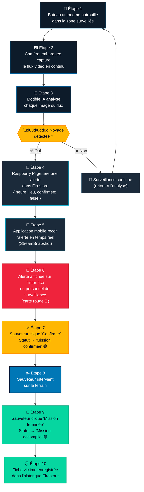
*Figure 9 — Schéma du fonctionnement complet du système RescueWave*

---

## 6. Conclusion

RescueWave est une application mobile de surveillance aquatique qui s'inscrit dans une vision globale de sécurité des espaces nautiques. En s'appuyant sur Flutter pour le développement multiplateforme et Firebase pour la gestion des données en temps réel, elle offre au personnel de surveillance un outil réactif et centralisé pour coordonner les interventions de sauvetage.

Bien que l'application soit encore en cours de développement, les fonctionnalités clés sont déjà opérationnelles : authentification par rôle, réception et gestion des alertes de noyade, historique des victimes et administration de l'équipe. Le couplage avec le sous-système embarqué sur le bateau — le Raspberry Pi doté d'un modèle d'intelligence artificielle — confère à ce système une dimension innovante qui réduit la dépendance à la vigilance humaine et améliore significativement le temps de réaction en cas d'incident aquatique.

Les développements futurs porteront notamment sur l'intégration complète des notifications push via Firebase Cloud Messaging, le renforcement du système d'authentification individuelle, l'affichage cartographique en temps réel de la position du bateau, ainsi que l'enrichissement des alertes avec les captures d'image issues de la caméra IA.
